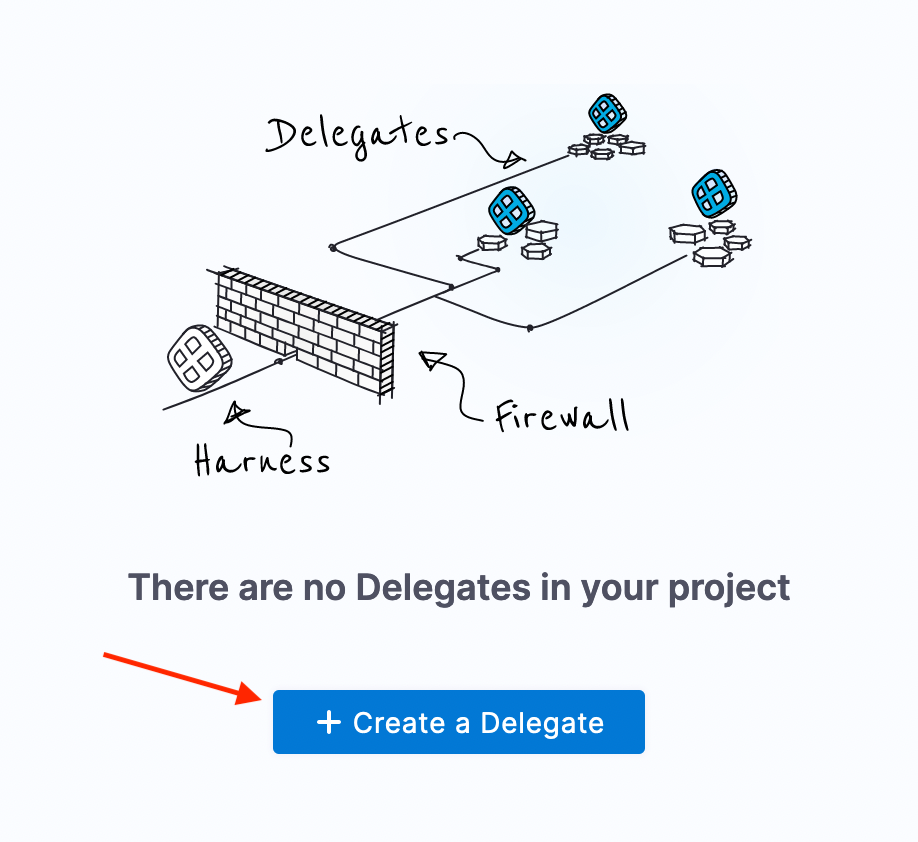

## Delegates

In our CI guide, we used a _Harness Hosted Delegate_. A bit of spiffy wizardry that makes CI as easy to set up as falling out of a nest. For continuous delivery, we’ll need to set up a delegate on our own Kubernetes cluster. This is one of my favorite proud-mascot moments. _The delegate enables your CI/CD work to happen in whatever compute environment you’re comfortable with._

Our delegate serves two purposes. First, to provide a secure communication link between Harness and your compute environment. Additionally, it allows Harness to delegate CI/CD tasks to your compute environment. Yeah, it’s why we named it the delegate. #NamingThingsIsHard

So now you need to create a delegate to continue. And by create, I mean you need to install the delegate in your compute environment. If you’re familiar with the abbreviation k8s, then by all means - install the delegate. But before you abandon me to stretch your wings you need to know one thing. For the purposes of this guide, we’re expecting you to setup a kubernetes-based delegate. You’ll find air traffic control has built in a few guidelines and helpers in the Harness UI to guide you. Go ahead and switch over to Harness CI and click that ‘create a delegate’ button. We’ll wait. Canary's are nothing if not patient. 

If you’re a bit earlier on the learning curve - say you know in theory what k8s is but, have never used it before that’s ok. We’ve got your back, and we all started out knowing less than you do now. Click here, and we’ll walk through all the steps needed to setup a delegate.

<a class="btn btn-primary" href="../Pipeline/serverIntro">👏 Ok, I created a Delegate and it's showing up as connected</a>

<a class="btn btn-primary" href="../Delegate/delegateDetails">I got this, but I'd like the walk through please.</a>
