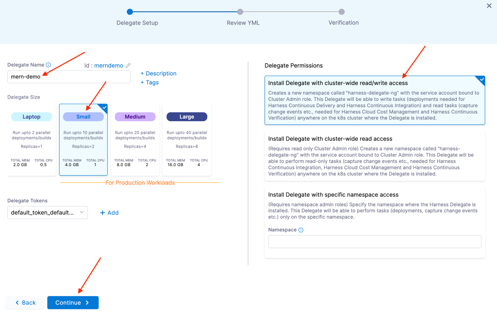
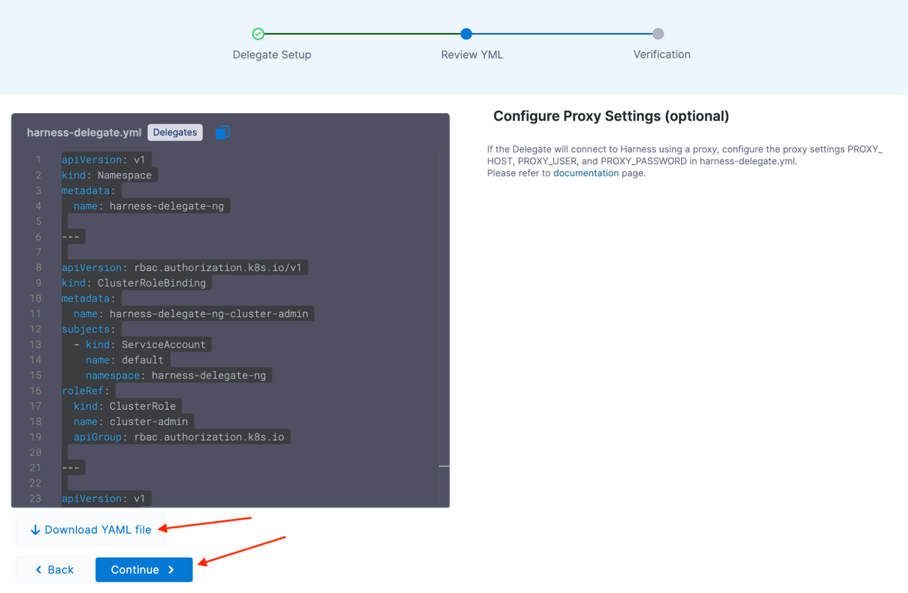
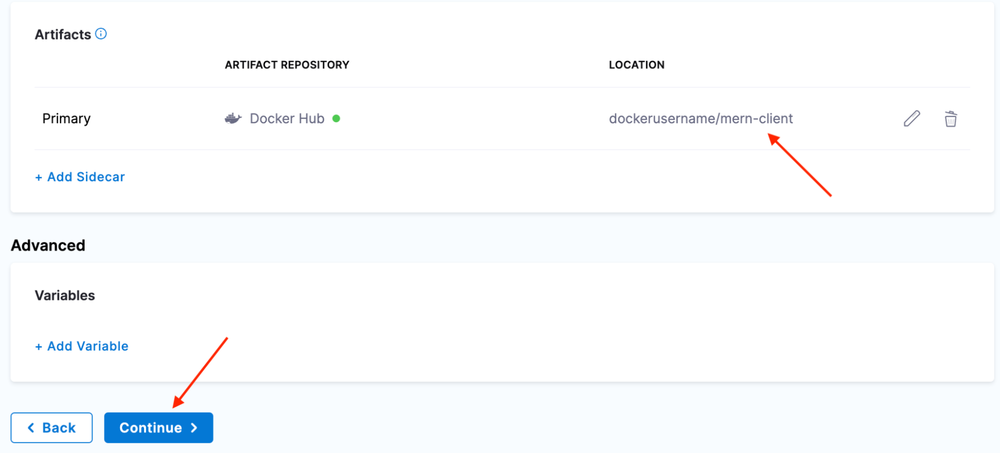
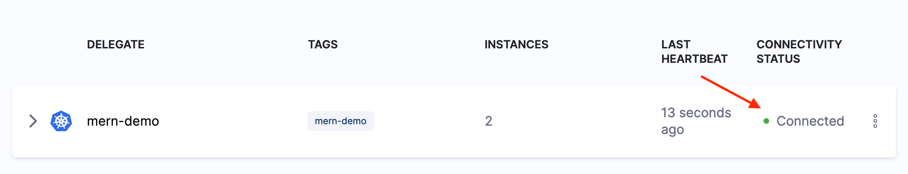

## Delegates

Switch over to the Harness UI in another window. Navigate to your project and when you see the ‘There are no Delegates in your project’ screen like the screenshot above then:

Select **Kubernetes**, then click **Continue**.


Enter “mern-demo” in the **Delegate Name** field.

Select **Small** for the **Delegate Size**.

On the right side under Delegate Permissions select

Install Delegate with cluster-wide read/write access. Then click Continue.



Click **Download YAML file**, then click **Continue**.



Harness will wait for your Delegate’s heartbeat, click **Done**.




Open a terminal in the directory where you downloaded the YAML file. Use kubectl to apply the configuration.

You should see output similar to this:


```
$ kubectl apply -f harness-delegate.yml
namespace/harness-delegate-ng created
clusterrolebinding.rbac.authorization.k8s.io/harness-delegate-ng-cluster-admin created
secret/demo-proxy created
statefulset.apps/demo created
service/delegate-service created
```


The delegate should show **Connected** in a few minutes.



## All done!

<a class="btn btn-primary" href="../Pipeline/serverIntro">👏 Ok, I created a Delegate and it's showing up as connected</a>

