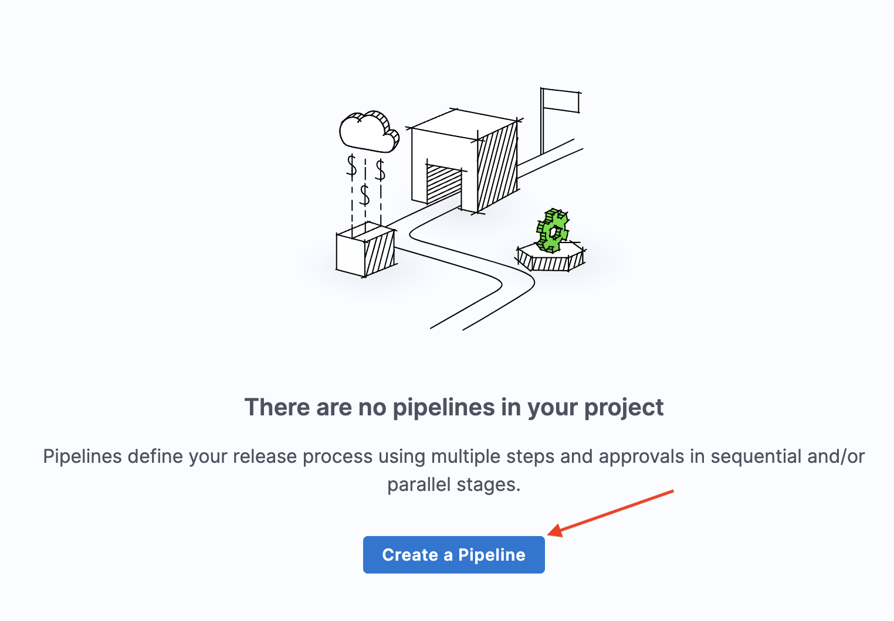
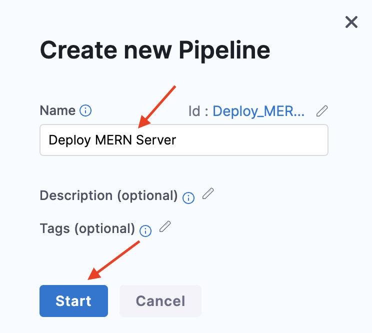
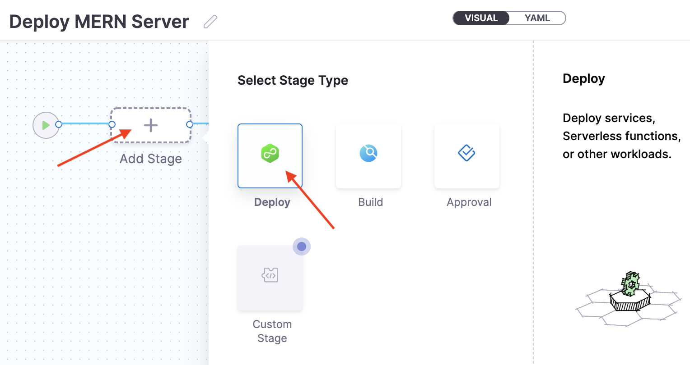
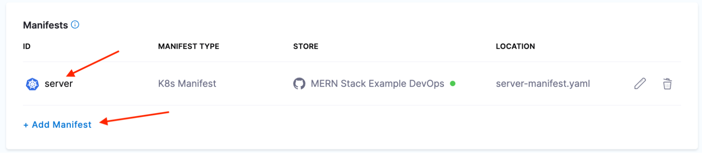
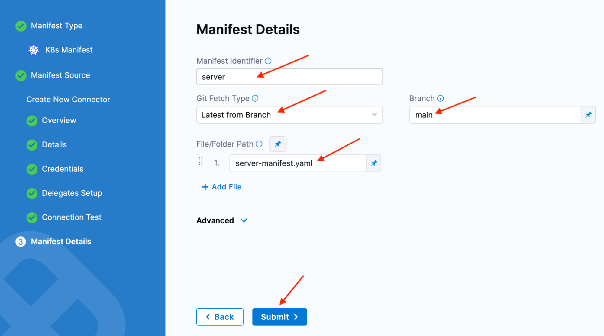
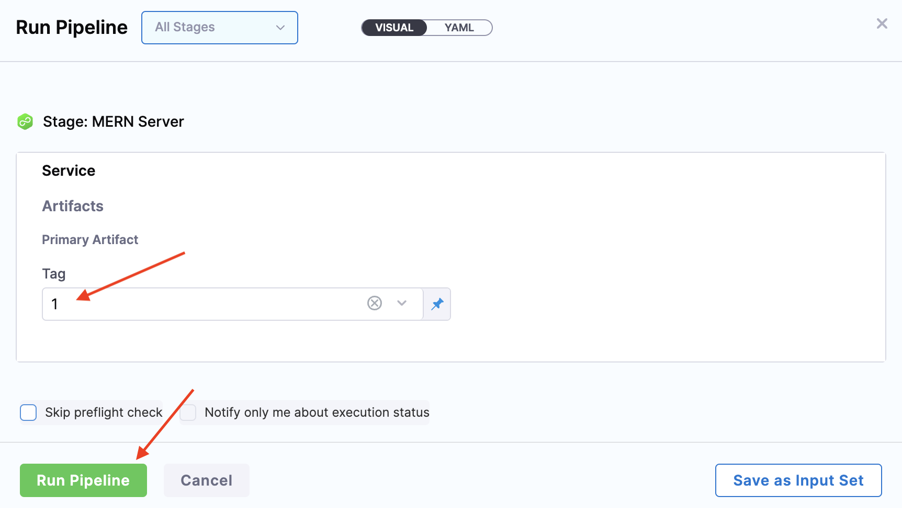

## Deployment Pipelines 
MERN Server CD Pipeline
Tweet! Tweet!, Captain Canary again. Unlike our CI getting started guide, we get to jump headfirst into the fun part. That is, of course, if you’ve gone through the CI getting started guide. If you've not completed the CI getting started guide, do not jump in headfirst here. It's a rule, like no swimming for 30minutes after food.

Open Harness CD and click Create a Pipeline.



Enter “Deploy MERN Server” in the **Name** field, then click **Start**.



### Stage

Click **Add Stage**, then select **Deploy**.



Enter “MERN Server” in the **Stage Name** field.

Make sure to select **Service** when prompted about **What would you like to deploy?**, then click **Set Up Stage**.


#### Server Manifest

Select **MERN Server** from the **Specify Service** drop-down menu.

Select **Kubernetes** for the **Deployment Type**, then click **Add Manifest**.


Select **K8s Manifest**, then click **Continue.**


Select **GitHub**, then click **Select GitHub Connector**.


Select **MERN Stack Example GitOps**, then click **Apply Selected**.


Verify that **MERN Stack Example GitOps** appears in the **GitHub Connector** field, then click **Continue**.


Enter “server” in the **Manifest Identifier** field.

Make sure you select Latest from Branch in the Git Fetch Type field.

Enter “main” in the **Branch** field.

Enter “server-manifest.yaml” in the **File/Folder Path** field, then click **Submit**.


#### Server Manifest Values

Folks, this is the Captain. I want to pause here for a moment to talk about GitOps and manifest values. You’re gonna love’m. #proudMascotMoment. You see harness uses these value files to solve one of the time struggles of GitOps. How do you keep all your configuration in Git, without committing secrets? Continue on to learn how! (And they say Canary’s can’t do foreshadowing)  

Open your clone of the MERN-Stack-Example-GitOps repo. There you’ll find a file creatively named server-manifest-values.yaml. Harness CD interpolates these key/values into the Kubernetes manifest(s) during deployment.

Verify that the **server** entry appears in the manifest list, then click **Add Manifest**.



Select **Values YAML**, then click **Continue**.


Select **GitHub**, then click **Select GitHub Connector**.


Select **MERN Stack Example GitOps**, then click **Apply Selected**.


Verify that you select the MERN Stack Example GitOps in the GitHub Connector field. Then click Continue.


Enter “serverValues” in the **Manifest Identifier** field.

Choose the Latest** from Branch** option for the **Git Fetch Type** field.

Enter “main” in the **Branch** field.

Enter “server-manifest-values.yaml” in the **File/Folder Path** field, then click **Submit**.



#### Server Artifact

Verify that **serverValues** appears in the manifest list, then click **Add Primary Artifact**.


Click **Docker Registry**, then click **Continue**.


Click **Select Docker Registry Connector**.


Select **Docker Hub**, then click **Apply Selected**.


Choose Docker Hub in the Docker Registry Connector field, then click Continue.


Choose Docker Hub in the Docker Registry Connector field, then click Continue.


Verify that **mern-server** appears in the artifact list, then click **Continue**.


Select **demo** from the drop-down menu in the **Specify Environment** field.

Verify that you selected Kubernetes for Infrastructure Definition, then click Select Connector.


Select **My Cluster**, then click **Apply Selected**.


Verify that **My Cluster** appears in the **Connector** field.

Enter “demo” in the **Namespace** field, then click **Continue**.


Folks, this is your Captain speaking. We’re about to fly through an area of potential questions. In this guide we’re using a Rolling deployment Strategy. You can find out all about the deployment strategies available here. For now, it's enough to know a Rolling deployment works by updating pods one at a time

Select the **Rolling**, then click **Use Strategy**.


### Run Pipeline

Click **Save**.


Click **Run**.


Select **1** from the drop-down menu in the **Tag** field, then click **Run Pipeline**.



Wait for the deployment to complete.


Run `kubectl` to retrieve the external IP of the MERN server. In this example, the external IP is `34.75.52.141`, yours will be different.


```
$ kubectl --namespace demo get service/server
NAME     TYPE           CLUSTER-IP     EXTERNAL-IP   PORT(S)          AGE
server   LoadBalancer   10.108.0.220   34.75.52.141   5001:30489/TCP   3m3s
```


Alright, that’s it. Have that lovely beverage now. You’ve built a continuous deployment pipeline with Harness CD. That’s worthy of a tweet. Come @ me!! Tweet @codefriar and tag it with #FirstCDPipeline #HarnessCD. You can also compliment my beautiful color, and engaging wit. 

Here’s where I’d normally kick you out of the proverbial nest, and let you soar! But this can be a bit overwhelming if you’re earlier on the learning curve of both CD, and say, Kubernetes. So let's walk through one more - and set up a continuous delivery pipeline for our frontend.
